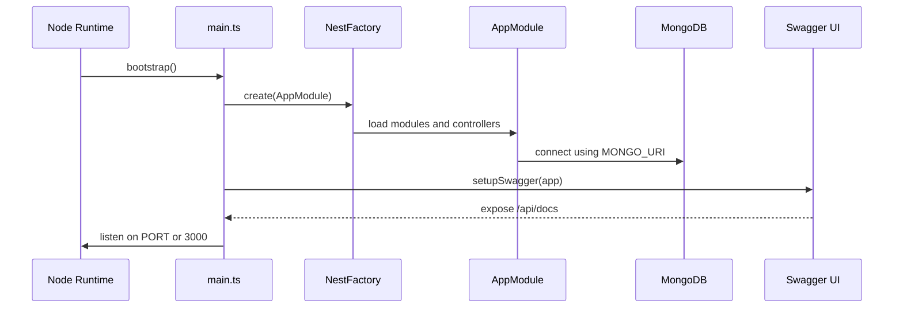
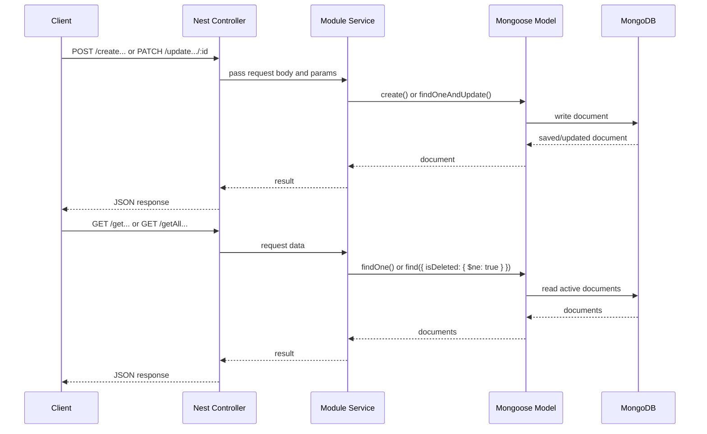
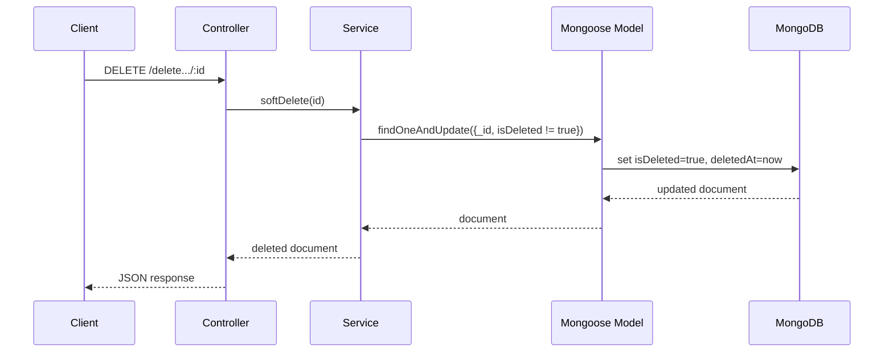
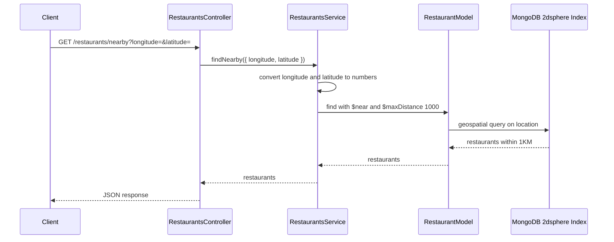
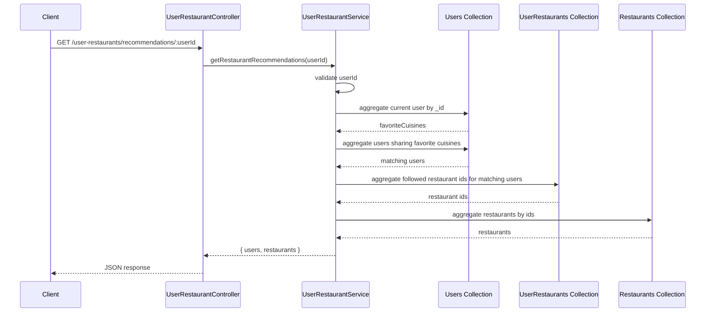
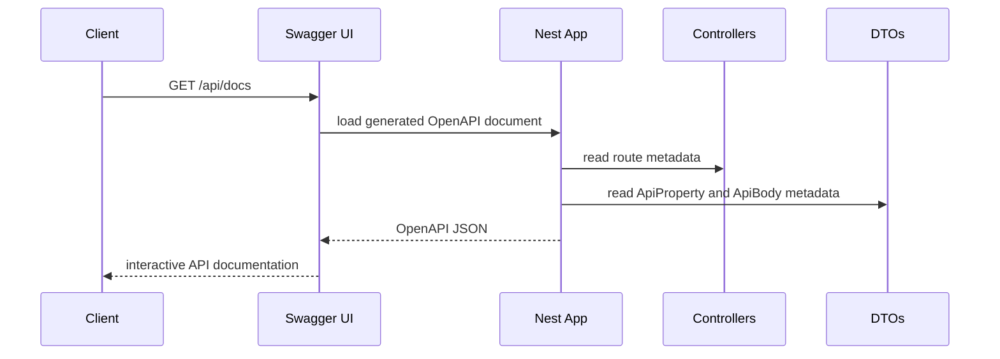
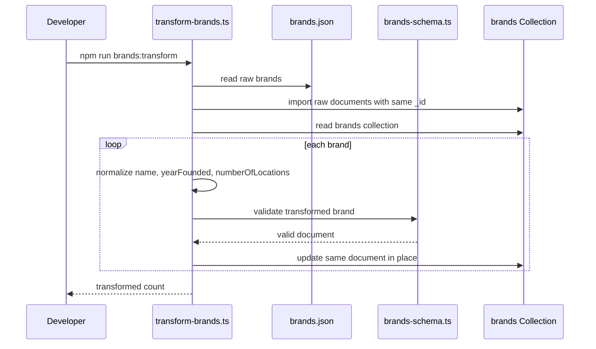

# Pleny Restaurant Sequence Diagrams

## Application Startup

## Standard Create / Read / Update Flow

This flow is used by users, cuisines, restaurants, and user-restaurant relations.

## Soft Delete Flow

Soft delete is used for users, cuisines, and restaurants.

## Nearby Restaurants Flow

## Restaurant Recommendations Flow

## Swagger Flow

## Brands Transformation Task

